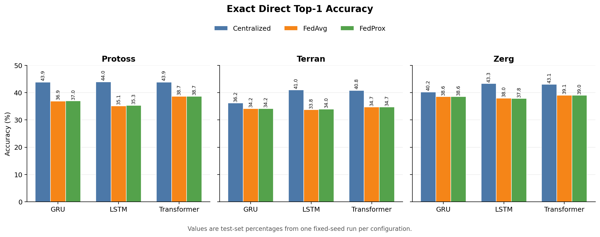
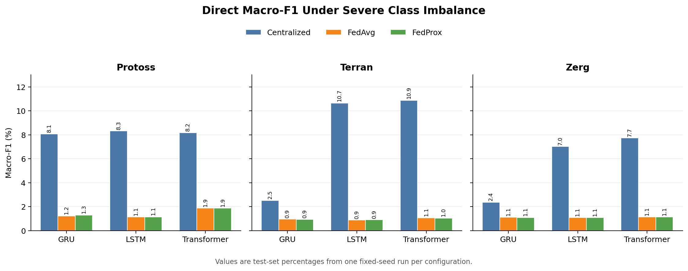
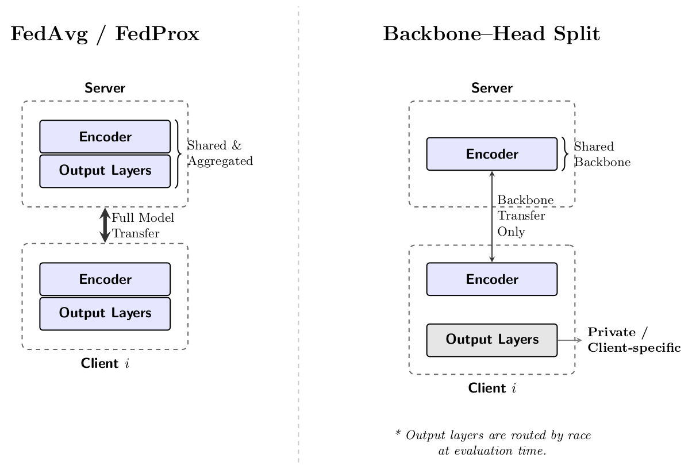

# Personalized Federated Learning for Player Action Prediction in StarCraft II

[](https://github.com/TarunB-Git/FederatedComparison/actions/workflows/tests.yml)
[](LICENSE)
[](CITATION.cff)

Research software and reproducibility artifacts developed for **Tarun Boddeda's 2026 Bachelor of Science thesis in Computer Science** at Blekinge Institute of Technology and the associated IEEE GEM 2026 paper.

[Results](#results) · [Reproduction guide](#reproduction) · [Citation](#citation)

**Associated paper:** Tarun Boddeda, Tayyab Ateeq, Prashant Goswami, and Sadi Alawadi, “Personalized Federated Learning for Player Action Prediction in StarCraft II,” accepted and presented at IEEE GEM 2026. The archival IEEE Xplore publication is pending.

## Why this work matters

Professional StarCraft II replays contain rich, player-specific behavioral traces. Centralized learning can model those traces effectively, but it requires replay data to be pooled. This project evaluates whether federated learning can retain useful next-action prediction performance while keeping each player's raw replay data local.

The benchmark compares GRU, LSTM, and Transformer encoders under centralized training, FedAvg, FedProx, and a personalized backbone–head design. In the federated simulations, training records are partitioned by player identifier and each training-set player partition acts as a client. The backbone–head variant shares only the encoder while retaining client-specific prediction heads locally.

The implementation covers preprocessing, hierarchical and direct action prediction, centralized and federated training, evaluation, checkpointing, communication accounting, and comparison across the complete experiment matrix.

## Results

The processed benchmark contains **10,088,820 action events**, **11,552 replays**, and **387 exact action labels**. The paper reports **30 trained configurations** built from 19 selected SC2EGSet archives labelled 2018–2024. [`DATA.md`](DATA.md) records the exact archive names.

Best Exact Direct Top-1 accuracy in each setting:

| Training paradigm | Best encoder | Protoss | Terran | Zerg |
| --- | --- | ---: | ---: | ---: |
| Centralized | LSTM | **43.99%** | **41.00%** | **43.34%** |
| FedAvg | Transformer | 38.69% | 34.71% | 39.09% |
| FedProx (μ = 0.01) | Transformer | 38.68% | 34.70% | 39.04% |

These values are point estimates from one fixed seed per configuration. The complete reported metrics are in [`results/paper_results.csv`](results/paper_results.csv); the saved-run protocol and artifact provenance are documented in [`results/README.md`](results/README.md).

Key findings:

- Comparing the best row in each paradigm, FedAvg trails the best centralized result by 5.30 percentage points on Protoss, 6.29 on Terran, and 4.25 on Zerg.
- Transformer was the strongest federated encoder for all three races.
- FedProx produced no systematic improvement over FedAvg at μ = 0.01.
- The all-races backbone–head runs are not directly comparable with the race-specific FedAvg and FedProx runs. Under the tested setup, local heads did not recover the accuracy of those race-specific models.
- Exact accuracy and macro-F1 diverged sharply because the 387-class action distribution is highly imbalanced.





### Personalized backbone–head design

FedAvg and FedProx aggregate the complete model. The personalized variant aggregates only the encoder; the client-specific classification heads are not aggregated.



The three backbone–head runs were trained jointly across all races. Their aggregate Exact Direct Top-1 scores were 34.02% (GRU), 34.07% (LSTM), and 34.67% (Transformer), so they are reported separately from the per-race comparison above.

## Repository structure

```text
.
├── code/                          # preprocessing, models, training, and evaluation
│   ├── prepare.py                 # raw tournament data → processed artifacts
│   ├── pvp_raw_state_models.py    # GRU, LSTM, and Transformer encoders
│   ├── hier_models.py             # hierarchical model and aggregation helpers
│   ├── hier_centralized.py        # centralized baseline
│   ├── hier_fedavg.py             # player-client FedAvg
│   ├── hier_fedprox.py            # player-client FedProx
│   ├── hier_backbone_head_race.py # personalized shared-backbone/local-head model
│   └── run_hier_pipeline.py       # end-to-end experiment orchestration
├── results/                       # paper result matrix and provenance
│   └── paper_protocol.json        # normalized saved-run configuration
├── figures/                       # architecture and generated result figures
├── scripts/                       # reproducible figure generation
├── tests/                         # fast synthetic model tests
├── DATA.md                        # dataset source and exact 19-archive manifest
├── CHEATSHEET.md                  # concise command reference
└── CITATION.cff                   # machine-readable citation metadata
```

## Reproduction

### 1. Environment

The reported experiments used Python 3.11.9. The direct dependency versions are pinned in `requirements.txt`. For a CPU-only environment, install the PyTorch CPU wheel first so that the requirements step does not select a CUDA build.

```bash
git clone https://github.com/TarunB-Git/FederatedComparison.git
cd FederatedComparison
python -m venv .venv
source .venv/bin/activate
python -m pip install --upgrade pip
python -m pip install torch==2.0.1 --index-url https://download.pytorch.org/whl/cpu
python -m pip install -r requirements.txt
```

GPU runs require a PyTorch 2.0.1 build compatible with the local CUDA runtime. Replace the pinned PyTorch wheel using the official PyTorch installation selector while keeping the remaining dependency versions fixed.

### 2. Data

The experiments use [SC2EGSet](https://doi.org/10.1038/s41597-023-02510-7). Raw replay-derived archives are not stored in Git because individual files exceed GitHub's size limit.

Place the 19 selected archive directories at the repository root. Each directory must contain its matching `*_data.zip`; download and layout instructions are in [`DATA.md`](DATA.md). Then run:

```bash
python code/prepare.py \
  --root . \
  --outdir artifacts \
  --hierarchy-taxonomy legacy8 \
  --split-mode replay
```

This creates `processed_events.parquet`, preprocessing metadata, the action vocabulary, and split audits under `artifacts/`.

### 3. Smoke test

First create a small dataset from five replay records per selected archive:

```bash
python code/prepare.py \
  --root . \
  --outdir artifacts_smoke \
  --hierarchy-taxonomy legacy8 \
  --split-mode replay \
  --smoke
```

Then verify the complete training pipeline on that dataset:

```bash
python code/run_hier_pipeline.py \
  --profile smoke \
  --dataset-dir artifacts_smoke \
  --outroot runs/hier_pipeline_smoke \
  --workers 0
```

The smoke profile checks preprocessing, centralized training, FedAvg, FedProx, backbone–head personalization, evaluation, and result aggregation. It uses a single data-loading process for portability and is an execution check rather than a performance benchmark.

### 4. Full experiment matrix

```bash
python code/run_hier_pipeline.py \
  --profile full \
  --dataset-dir artifacts \
  --outroot runs/hier_pipeline_full \
  --device cuda \
  --modes centralized,fedavg,fedprox,backbone_head \
  --archs gru,lstm,transformer \
  --races Prot,Terr,Zerg \
  --backbone-races all \
  --bs 512 \
  --clients-per-round 25 \
  --rounds 50 \
  --backbone-rounds 150 \
  --max-client-samples 2000 \
  --local-weight-decay 1e-5 \
  --backbone-max-client-samples 0 \
  --backbone-local-weight-decay 0 \
  --max-local-batches 75 \
  --early-stop-patience 100 \
  --round-val-clients 50 \
  --central-workers 8 \
  --federated-workers 0
```

This command reproduces the saved configurations behind the reported tables. FedAvg and FedProx use 50 rounds, a 2,000-event client cap, and `1e-5` local weight decay. The all-races backbone–head ablation uses 150 rounds, no client sample cap, zero local weight decay, and a 75-batch local ceiling. These recorded exceptions are summarized in [`results/paper_protocol.json`](results/paper_protocol.json).

Use a new or empty `--outroot` for a clean reproduction. A completed run with `final_test.json` is skipped so that an existing result is not overwritten accidentally.

Training outputs include checkpoints, `final_test.json`, `cross_run_results.csv`, confusion matrices, learning curves, timing, and communication metrics. See [`CHEATSHEET.md`](CHEATSHEET.md) for valid individual commands and commonly used flags.

### 5. Regenerate repository figures

```bash
python scripts/generate_readme_figures.py
```

The script reads only the checked-in paper result matrix and writes the two result plots to `figures/`.

### 6. Run tests

```bash
python -m unittest discover -s tests -v
```

The test suite uses synthetic tensors, so it does not require SC2EGSet.

## Evaluation notes and limitations

- **Primary metric:** Exact Direct Top-1 accuracy from the auxiliary exact-action head. Macro-F1, balanced accuracy, and kappa are necessary complements because of class imbalance.
- **Split:** replay-level train/validation/test separation. Players may appear in more than one split through different replays.
- **Player identifiers:** the full processed artifact contains 1,314 unique player identifiers; 1,305 occur in the training split and therefore form the candidate client pool. The paper's 1,305 figure refers to this training-client population. Split-level unique counts overlap and must not be added together.
- **Federated clients:** one client partition per training-set player identifier; client partitions are naturally non-IID.
- **Statistical scope:** each configuration used one fixed seed. Differences should be interpreted as point estimates, not statistically significant effects.
- **Privacy scope:** the code simulates data-local training by partitioning a centrally available dataset by player identifier. It does not enforce physical data isolation and does not provide differential privacy, secure aggregation, or protection against model-update leakage.
- **Execution scope:** federated experiments were simulated on one machine rather than deployed across separate devices or networks.

## Citation

GitHub can render the preferred citation directly from [`CITATION.cff`](CITATION.cff). Until the archival record and DOI are available, cite the conference presentation as:

> T. Boddeda, T. Ateeq, P. Goswami, and S. Alawadi, “Personalized Federated Learning for Player Action Prediction in StarCraft II,” presented at the *2026 IEEE Gaming, Entertainment and Media Conference (GEM)*, 2026.

## License

The source code is released under the [MIT License](LICENSE). SC2EGSet is distributed separately under the dataset terms documented in [`DATA.md`](DATA.md).

## Acknowledgements

This work uses the SC2EGSet dataset by Białecki *et al.* The implementation and experiments were developed as part of Tarun Boddeda's Bachelor of Science thesis in Computer Science at Blekinge Institute of Technology.
